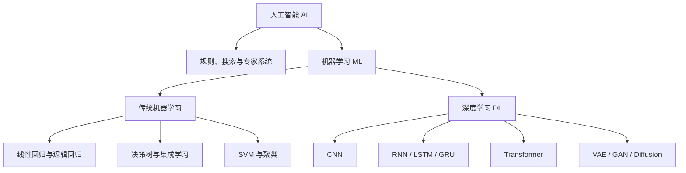

# AI、机器学习与深度学习的区别和联系

## 一句话结论

> 人工智能是总目标，机器学习是实现人工智能的一类方法，深度学习是机器学习中使用多层神经网络的一条技术路线。

## 概念层级



## 1. 人工智能 AI

人工智能关注的是：**怎样让机器完成通常需要智能才能完成的任务？**

它包括但不限于：

- 人工编写的规则系统；
- 搜索与规划算法；
- 专家系统；
- 机器学习；
- 机器人和智能体。

所以，一个系统即使没有从数据中学习，也可能属于人工智能。

## 2. 机器学习 ML

机器学习关注的是：**怎样让机器从数据中总结规律，而不是由人写出所有判断规则？**

以垃圾邮件识别为例：

- 传统规则程序：人工规定出现哪些词语时判为垃圾邮件；
- 机器学习：提供大量邮件及其标签，让模型学习区分规律。

常见学习方式：

| 学习方式 | 数据是否带答案 | 典型任务 |
| --- | --- | --- |
| 监督学习 | 带标签 | 分类、回归 |
| 无监督学习 | 不带标签 | 聚类、降维、异常检测 |
| 自监督学习 | 从数据本身构造标签 | 语言模型、表征学习 |
| 强化学习 | 通过奖励反馈 | 游戏、控制、决策 |

## 3. 深度学习 DL

深度学习是机器学习的一部分，其主要模型是多层神经网络。

传统机器学习往往需要人先设计特征，再交给模型判断；深度学习倾向于从原始数据中逐层学习特征和任务目标。

例如图像识别中的特征可能逐层形成：

```text
像素 → 边缘 → 纹理 → 局部形状 → 物体组成部分 → 完整物体
```

## 4. 必须区分的五个层级

| 层级 | 回答的问题 | 示例 |
| --- | --- | --- |
| 应用领域 | 要解决什么现实问题？ | 视觉、自然语言、语音、推荐 |
| 学习方式 | 模型从什么反馈中学习？ | 监督、自监督、强化学习 |
| 任务类型 | 模型要输出什么？ | 分类、回归、生成、聚类 |
| 模型或架构 | 信息怎样计算和传递？ | 决策树、CNN、LSTM、Transformer |
| 实现工具 | 用什么软件构建和训练？ | scikit-learn、PyTorch、TensorFlow、Keras |

## 5. 常见误区

### 误区一：所有 AI 都是深度学习

不对。AI 还包括规则、搜索、规划等方法。

### 误区二：深度学习一定比传统机器学习好

不对。对于数据量较小、特征明确的表格数据，线性模型、决策树和梯度提升树往往更简单、更容易解释，也可能表现更好。

### 误区三：模型训练就是记住答案

理想情况下，训练的目标是学习能够推广到新数据的规律。只记住训练样本而不能处理新样本，通常称为过拟合。

### 误区四：算法、架构和框架是同一类名词

不对。Transformer 是架构，GPT 是基于该架构形成的模型家族，PyTorch 是实现和训练这些模型的框架。

## 自测问题

- [ ] 深度学习为什么属于机器学习？
- [ ] 一个完全由人工规则构成的专家系统是否属于 AI？
- [ ] 垃圾邮件识别属于分类还是回归？
- [ ] PyTorch 与 Transformer 为什么不能直接放在同一层比较？
- [ ] 什么情况下传统机器学习可能比深度学习更合适？

