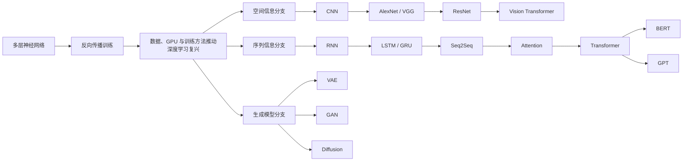

# 深度学习架构的发展脉络

## 核心认识

CNN、RNN、LSTM、Transformer 并不是简单的前后替代关系。

- CNN 主要针对空间结构和局部模式发展。
- RNN、LSTM、GRU 主要针对有顺序的数据发展。
- Transformer 最早集中解决序列建模和并行训练问题，后来扩展到视觉、语音和多模态。
- VAE、GAN、Diffusion 属于生成模型的另一条重要分支。

学习技术史时，应该使用下面的逻辑：

> 原有方法 → 遇到的瓶颈 → 新增的机制 → 新方法的优势与代价

## 总体发展地图



## 1. 多层神经网络与反向传播

神经网络训练需要回答：预测出错以后，每个参数应该修改多少？

反向传播负责根据损失函数计算各个参数的梯度，优化器再使用梯度更新参数。

几乎所有现代深度学习模型都遵循同一训练骨架：

```text
输入数据
  ↓
模型前向计算
  ↓
得到预测
  ↓
计算损失
  ↓
反向传播计算梯度
  ↓
优化器更新参数
  ↓
重复训练
```

架构的演化主要改变“前向计算时怎样组织和传递信息”，通常不会抛弃这套训练逻辑。

## 2. CNN：利用图像的空间结构

### 原有问题

将图像像素全部连接到普通全连接层会产生大量参数，而且没有主动利用相邻像素之间的关系。

### 新增机制

- **局部连接**：先观察局部区域。
- **参数共享**：同一组卷积核在不同位置重复使用。
- **多层特征提取**：从边缘逐渐组合成更复杂的结构。

### 适合任务

- 图像分类；
- 目标检测；
- 图像分割；
- 具有局部规律的语音或时序数据。

### 后续发展

- AlexNet 证明深层 CNN、GPU 和大规模数据结合的威力。
- VGG 通过规则地堆叠小卷积核加深网络。
- ResNet 使用残差连接，使更深网络更容易训练。
- Vision Transformer 将图像切分为图块，再用 Transformer 建模。

## 3. RNN：为序列增加状态

### 原有问题

普通网络通常把每个输入独立处理，不保存之前发生过什么。

### 新增机制

RNN 在处理当前输入时，同时接收上一步的隐藏状态：

```text
当前状态 = 当前输入 + 上一步状态经过变换后的结果
```

它像一个边阅读、边更新内部笔记的人。

### 主要限制

- 必须按照时间顺序计算，不容易充分并行。
- 序列很长时，容易出现梯度消失或梯度爆炸。
- 很早以前的信息可能难以影响当前输出。

## 4. LSTM 与 GRU：改进长期记忆

LSTM 是 RNN 家族中的特殊结构，而不是与 RNN 无关的新类别。

### 新增机制

LSTM 使用门控结构控制：

- 哪些信息写入记忆；
- 哪些信息继续保留；
- 哪些信息应该忘记；
- 哪些信息作为当前输出。

GRU 与 LSTM 思想相近，但门控数量更少、结构更紧凑。

### 仍然存在的限制

即使长期记忆有所改善，LSTM 依然要逐步处理序列，因此大规模训练的并行效率受到限制。

## 5. Seq2Seq 与 Attention

早期 Seq2Seq 常让编码器把整个输入序列压缩成一个固定长度向量，再由解码器生成结果。

当输入变长时，固定长度向量容易成为信息瓶颈。

Attention 的思想是：

> 生成当前输出时，不只依赖最终压缩结果，而是直接查看输入中与当前任务最相关的部分。

它让模型能够动态决定“现在应该重点看哪里”。

## 6. Transformer：使用自注意力建模关系

Transformer 进一步移除序列中的循环计算，主要使用 Self-Attention 让不同位置直接交换信息。

### 主要优势

- 能更直接地建模远距离关系；
- 训练时可以并行处理多个位置；
- 容易扩大数据规模和模型规模；
- 可以扩展到语言、视觉、语音和多模态。

### 主要代价

- 标准自注意力处理很长序列时，计算量和显存占用增长较快；
- 模型通常需要大量数据和计算资源；
- 没有循环结构，需要通过位置编码等机制表示顺序。

## 7. 架构横向比较

| 架构 | 核心机制 | 主要优势 | 典型限制 |
| --- | --- | --- | --- |
| MLP | 全连接非线性变换 | 通用、结构简单 | 不主动利用空间或顺序 |
| CNN | 局部连接、参数共享 | 擅长局部与空间模式 | 长距离关系需要多层传播 |
| RNN | 循环隐藏状态 | 自然表示顺序 | 长期依赖与并行困难 |
| LSTM/GRU | 门控记忆 | 改善长期依赖 | 仍需顺序计算 |
| Transformer | 自注意力 | 全局关系、并行训练 | 长序列成本较高 |

## 8. 技术演化不是完全替代

现代系统经常组合多种结构：

- CNN 提取局部图像特征，Transformer 建模全局关系。
- CNN 处理音频频谱，LSTM 处理时间变化。
- 小型实时设备可能使用 LSTM，而不是更大的 Transformer。
- Transformer 内仍然包含普通前馈神经网络等传统组件。

选择模型时要考虑数据结构、数据规模、硬件、延迟和可解释性，而不只是模型是否更新。

## 自测问题

- [ ] CNN 为什么比全连接网络更适合图像？
- [ ] RNN 的隐藏状态代表什么？
- [ ] LSTM 是怎样缓解长期依赖问题的？
- [ ] Attention 解决了 Seq2Seq 的什么瓶颈？
- [ ] Transformer 为什么比 RNN 更容易并行训练？
- [ ] 为什么不能说 Transformer 已经在所有场景淘汰了 CNN 和 LSTM？

## 延伸阅读

- [Learning representations by back-propagating errors](https://www.nature.com/articles/323533a0)
- [Long Short-Term Memory](https://direct.mit.edu/neco/article/9/8/1735/6109/Long-Short-Term-Memory)
- [ImageNet Classification with Deep Convolutional Neural Networks](https://papers.nips.cc/paper_files/paper/2012/hash/c399862d3b9d6b76c8436e924a68c45b-Abstract.html)
- [Neural Machine Translation by Jointly Learning to Align and Translate](https://arxiv.org/abs/1409.0473)
- [Attention Is All You Need](https://arxiv.org/abs/1706.03762)

