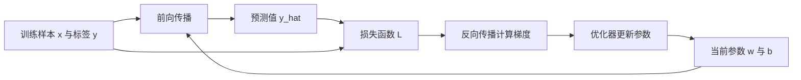
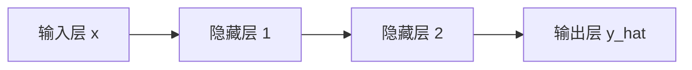
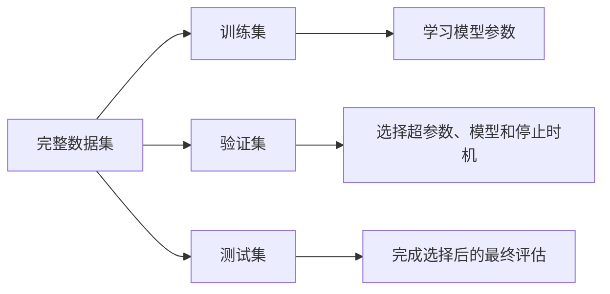

# 神经网络如何学习：理论基础

## 学习目标

完成本课后，应当能够：

- 区分样本、特征、标签、参数和超参数；
- 解释前向传播、损失函数、反向传播和梯度下降的分工；
- 解释训练集、验证集和测试集为什么不能混用；
- 根据训练损失和验证损失判断是否出现过拟合；
- 描述一次完整的神经网络训练循环。

## 1. 先看完整训练过程



训练的本质可以概括为：

> 使用当前参数做出预测，衡量预测有多错，计算每个参数对错误的影响，再把参数向减小错误的方向调整。

模型会重复这一过程很多次，直到损失不再明显下降，或者达到预先设定的停止条件。

## 2. 数据中的基本概念

假设我们要根据房屋信息预测房价。

| 面积 | 卧室数 | 房龄 | 实际价格 |
| ---: | ---: | ---: | ---: |
| 80 平方米 | 2 | 5 年 | 160 万元 |
| 120 平方米 | 3 | 2 年 | 260 万元 |

### 2.1 样本 Sample

数据集中的一条完整记录称为一个样本。

上表每一行就是一个房屋样本。

### 2.2 特征 Feature

输入给模型、用于做出判断的信息称为特征，通常记为 `x`。

上例中的面积、卧室数和房龄都是特征：

```text
x = [面积, 卧室数, 房龄]
```

一个样本可以只有一个特征，也可以有成千上万个特征。例如，图像的像素值和文本中的 token 表示也可以成为模型输入。

### 2.3 标签 Label 或 Target

监督学习中希望模型预测的正确答案称为标签，通常记为 `y`。

- 房价预测中的实际价格是标签；
- 猫狗分类中的“猫”或“狗”是标签；
- 垃圾邮件识别中的“垃圾邮件/正常邮件”是标签。

没有标签并不等于不能学习。无监督学习不使用人工标签，自监督学习则从数据本身构造学习目标。

## 3. 参数与超参数

这是两个非常容易混淆的概念。

### 3.1 参数 Parameter

参数是模型在训练过程中根据数据自动学习的数值。

最简单的线性模型为：

```text
y_hat = w × x + b
```

其中：

- `x`：输入特征；
- `y_hat`：模型预测值；
- `w`：权重，表示特征对结果的影响程度；
- `b`：偏置，帮助模型整体平移预测结果。

`w` 和 `b` 都是参数。神经网络的参数主要就是大量权重和偏置。

### 3.2 超参数 Hyperparameter

超参数是训练开始前由人设置，或通过验证实验选择的配置。

常见超参数包括：

- 学习率；
- 批次大小；
- 训练轮数；
- 隐藏层数量；
- 每层神经元数量；
- Dropout 比例；
- 正则化强度。

### 3.3 两者区别

| 对比 | 参数 | 超参数 |
| --- | --- | --- |
| 谁决定 | 模型从训练数据中学习 | 人工设置或通过验证集选择 |
| 何时变化 | 训练过程中不断更新 | 通常在一次训练开始前确定 |
| 示例 | 权重、偏置 | 学习率、层数、批次大小 |

更严谨地说，超参数也可以被自动搜索，但它们不是普通反向传播中直接学习的模型权重。

## 4. 前向传播：模型怎样得到预测

前向传播 Forward Propagation 是把输入按照网络结构从前向后计算，最终得到预测的过程。

对于一个神经元：

```text
z = w₁x₁ + w₂x₂ + ... + b
a = activation(z)
```

其中：

- 加权求和 `z` 汇总输入信息；
- 激活函数让模型能够表达非线性关系；
- 激活后的 `a` 作为本层输出，传给下一层。

多层网络可以表示为：



“传播”不是说神经元在移动，而是数值依次经过矩阵乘法、加法和激活函数变换。

## 5. 损失函数：模型错了多少

模型得到预测值以后，需要用损失函数 Loss Function 衡量预测与真实标签之间的差距。

损失越小，通常说明当前预测越接近训练目标。

### 5.1 回归常用损失：均方误差

均方误差 MSE 的思想是计算预测误差的平方并求平均：

```text
MSE = 平均值((预测值 - 真实值)²)
```

平方有两个作用：

- 正负误差不会相互抵消；
- 较大的错误会受到更强惩罚。

### 5.2 分类常用损失：交叉熵

分类模型通常输出每个类别的概率。交叉熵会在模型给正确类别的概率很低时给予较大的惩罚。

例如真实类别是“猫”：

- 模型认为猫的概率是 0.95，损失较小；
- 模型认为猫的概率是 0.05，损失较大。

### 5.3 损失函数与评价指标

二者有关，但用途不同：

- **损失函数**：训练时提供可计算的优化目标，通常需要可求导；
- **评价指标**：帮助人理解模型表现，例如准确率、召回率、F1、平均绝对误差。

模型可能使用交叉熵训练，却使用准确率向人汇报结果。

## 6. 梯度：参数变化会怎样影响损失

梯度可以理解为：

> 每个参数稍微变化时，损失会朝哪个方向变化，以及变化得有多快。

如果某参数的梯度为正，增加该参数会使损失增大，因此通常应该减小参数；如果梯度为负，适当增大参数可能使损失下降。

梯度不是误差本身，而是“损失对参数的变化率”。

## 7. 反向传播：高效计算所有梯度

神经网络可能有数百万甚至更多参数。逐个尝试参数增减会非常低效。

反向传播 Backpropagation 使用微积分中的链式法则，从输出层向输入层反向计算：

```text
损失
  ↓ 对输出的影响
输出层参数梯度
  ↓
隐藏层参数梯度
  ↓
更前面各层的参数梯度
```

每一层只需要结合：

1. 后一层传回来的梯度；
2. 本层前向传播时保存的中间结果；
3. 本层运算的局部导数。

### 必须分清

- **反向传播**：负责计算梯度。
- **梯度下降或优化器**：负责根据梯度更新参数。

反向传播本身不会替你决定学习率，也不是参数更新公式的全部。

## 8. 梯度下降：沿着减小损失的方向更新

最基本的参数更新规则是：

```text
新参数 = 旧参数 - 学习率 × 梯度
```

学习率控制每次更新迈多大一步。

### 学习率太大

- 可能跨过较优位置；
- 损失上下震荡；
- 训练甚至发散。

### 学习率太小

- 训练速度很慢；
- 可能在有限训练时间内还没有学到有效结果。

### 常见梯度下降形式

| 形式 | 每次用多少训练样本计算梯度 | 特点 |
| --- | --- | --- |
| 批量梯度下降 | 全部训练样本 | 稳定，但每次更新成本高 |
| 随机梯度下降 SGD | 一个样本 | 更新快但波动较大 |
| 小批量梯度下降 | 一小批样本 | 计算效率与稳定性的常用折中 |

日常口语中的“SGD”有时泛指随机优化过程，具体实现通常使用小批量数据。

## 9. 一个最小数字示例

假设只有一个训练样本：

```text
x = 2
y = 5
```

模型为：

```text
y_hat = w × x + b
```

初始参数设为：

```text
w = 1.5
b = 0.5
```

### 第一步：前向传播

```text
y_hat = 1.5 × 2 + 0.5 = 3.5
```

模型预测 3.5，真实答案是 5。

### 第二步：计算损失

使用单样本平方误差：

```text
L = (y_hat - y)²
  = (3.5 - 5)²
  = 2.25
```

### 第三步：反向传播

对参数求梯度：

```text
∂L/∂w = 2 × (y_hat - y) × x = -6
∂L/∂b = 2 × (y_hat - y)     = -3
```

负梯度表示适当增大当前参数会让损失下降。

### 第四步：更新参数

若学习率为 0.1：

```text
w_new = 1.5 - 0.1 × (-6) = 2.1
b_new = 0.5 - 0.1 × (-3) = 0.8
```

更新后的预测为：

```text
y_hat_new = 2.1 × 2 + 0.8 = 5.0
```

在这个特意构造的单样本例子里，一次更新正好得到正确答案。真实数据包含很多样本、噪声和复杂关系，通常需要许多轮更新，而且不会每次都恰好到达最佳结果。

## 10. Epoch、Batch 与 Iteration

假设训练集有 1,000 个样本，批次大小为 100：

- **Batch**：一次送入模型的 100 个样本；
- **Iteration/Step**：模型使用一个 Batch 完成一次参数更新；
- **Epoch**：全部 1,000 个训练样本都被使用一遍；
- 每个 Epoch 通常包含 `1000 ÷ 100 = 10` 个 Iteration。

训练 20 个 Epoch，表示模型大致完整查看训练集 20 遍，而不是只更新 20 次。

## 11. 训练集、验证集与测试集

仅仅让模型在见过的数据上表现好是不够的。真正目标是对没有见过的新数据也有效，这种能力称为泛化。



### 11.1 训练集 Training Set

用于前向传播、计算损失、反向传播和更新参数。模型会直接从训练集学习。

### 11.2 验证集 Validation Set

用于：

- 比较学习率、网络深度等超参数；
- 选择不同候选模型；
- 判断何时停止训练；
- 观察是否过拟合。

验证集通常不参与普通的参数梯度更新，但反复根据验证结果调整方案，意味着我们间接利用了验证集信息。

### 11.3 测试集 Test Set

测试集用于在所有模型选择基本完成后，进行尽量客观的最终评估。

如果不断查看测试集并据此修改模型，测试集实际上已经变成了验证集，最终结果就可能过于乐观。

### 11.4 数据泄漏

数据泄漏是指训练过程中意外使用了本不该看到的验证集、测试集或未来信息。

常见例子：

- 在划分数据前，使用全体数据计算标准化均值和方差；
- 同一个人的相似样本同时出现在训练集和测试集；
- 时间序列预测中使用了未来时刻的信息；
- 根据测试集表现反复选择模型。

## 12. 过拟合与欠拟合

### 12.1 欠拟合 Underfitting

模型连训练数据中的主要规律都没有学好。

常见表现：

- 训练损失较高；
- 验证损失也较高；
- 训练集和验证集表现都不好。

可能原因包括模型过于简单、训练不足、特征不足或学习率不合适。

### 12.2 过拟合 Overfitting

模型过度适应训练数据中的细节和噪声，却不能推广到新数据。

典型表现：

```text
训练继续进行：训练损失持续下降
验证集表现：先改善，随后开始变差
```

训练集表现越来越好，不代表模型一定越来越有用。

### 12.3 常见缓解方法

- 收集更多有代表性的数据；
- 使用数据增强；
- 减小模型复杂度；
- 使用 L1/L2 正则化或权重衰减；
- 使用 Dropout；
- 使用 Early Stopping；
- 改善数据划分，避免数据泄漏；
- 在数据较少时使用交叉验证。

## 13. 完整训练与验证循环

```text
初始化模型参数

重复多个 Epoch：
    将训练数据划分为多个 Batch

    对每个 Batch：
        1. 前向传播得到预测
        2. 计算训练损失
        3. 清除上一轮遗留梯度
        4. 反向传播计算梯度
        5. 优化器更新参数

    使用验证集进行前向计算：
        1. 不更新参数
        2. 记录验证损失和评价指标
        3. 判断是否过拟合或需要提前停止

训练和模型选择完成后：
    使用测试集进行一次最终评估
```

## 14. 最容易混淆的关系

| 容易混淆的概念 | 正确关系 |
| --- | --- |
| 标签与预测 | 标签是正确目标，预测是模型当前输出 |
| 参数与超参数 | 参数由训练学习，超参数控制训练和结构 |
| 前向传播与反向传播 | 前向产生预测，反向计算梯度 |
| 反向传播与梯度下降 | 反向传播算梯度，梯度下降更新参数 |
| 损失与准确率 | 损失用于优化，准确率等指标用于解释表现 |
| 验证集与测试集 | 验证集参与选择，测试集用于最终评估 |
| 训练效果与泛化效果 | 训练效果衡量见过的数据，泛化衡量新数据 |

## 15. 自测清单

只有能够脱离笔记回答，才建议将对应条目标记为完成。

- [ ] 什么是样本、特征和标签？
- [ ] 权重为什么是参数，学习率为什么是超参数？
- [ ] 前向传播完成了什么计算？
- [ ] 为什么训练需要损失函数？
- [ ] 梯度的正负和大小分别代表什么？
- [ ] 反向传播与梯度下降各自负责什么？
- [ ] 为什么参数更新公式中要减去梯度？
- [ ] Epoch、Batch 和 Iteration 有什么区别？
- [ ] 验证集为什么不能替代测试集？
- [ ] 训练损失持续下降、验证损失开始上升意味着什么？
- [ ] 数据泄漏为什么会使评估结果过于乐观？

## 下一步实践

1. 手算一个神经元的一次训练更新。
2. 用 NumPy 复现同样的计算。
3. 修改学习率，观察损失下降、震荡或发散。
4. 使用 PyTorch 的自动求导验证手算梯度。

