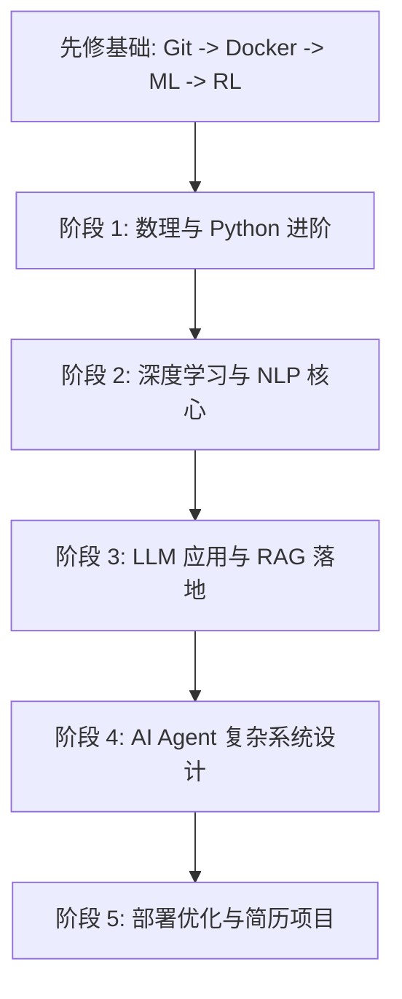

# AI & AI Agent 学习路线图 (AI & AI Agent Career Learning Roadmap)

本路线图专为有志于在未来从事 **AI Agent（智能体）**、**大语言模型（LLM）开发**及相关 AI 岗位的研究生设计。路线图兼顾学术深度（理论基础）与工程落地（动手实践），共分为五个阶段。

---

## 🗺️ 阶段概览



### 🔧 智能体先修课与目录结构
在进入大模型和 Agent 实际开发前，请按照以下顺序完成核心工程与算法筑基。我们已在工作区为你建立了对应的实践文件夹：

1. **Git 版本控制** ([01_Engineering_Tools/Git_Practice](file:///home/fire/AI_Agent/01_Engineering_Tools/Git_Practice))
   - **为什么学**：Agent 代码迭代迅速，团队协作与版本回滚是工程开发的生命线。
2. **Docker 容器化** ([01_Engineering_Tools/Docker_Practice](file:///home/fire/AI_Agent/01_Engineering_Tools/Docker_Practice))
   - **为什么学**：Chroma/Milvus 向量库、Redis 缓存、以及 Agent 运行所需的隔离执行沙箱，都需要利用 Docker 快速搭建和隔离运行。
3. **经典机器学习 (ML)** ([02_Machine_Learning](file:///home/fire/AI_Agent/02_Machine_Learning))
   - **为什么学**：大模型的损失函数、评估指标（Precision/Recall/F1）、梯度下降、欠拟合与过拟合等基本概念都继承自经典 ML。建议使用 `scikit-learn` 动手实现回归与分类模型。
4. **强化学习 (RL)** ([03_Reinforcement_Learning](file:///home/fire/AI_Agent/03_Reinforcement_Learning))
   - **为什么学**：现代大模型的对齐技术（RLHF/DPO/GRPO）和推理大模型（如 OpenAI o1, DeepSeek-R1）底层的“自我反思与推理链训练”，本质上都是强化学习在发挥作用。必须搞懂 MDP、策略与价值函数、以及 PPO 算法框架。

---

## ⏰ 时间规划与学习建议

### 1. 每日学习时间建议
*   **在校研究生/兼职备考**：建议每天投入 **3 - 4 小时** 高质量专注时间（避开实验室/导师杂事，集中在晚上或早晨）。
*   **全职备考/假期集中攻坚**：建议每天投入 **6 - 8 小时**，分模块学习（上午理论、下午编程实践、晚上看前沿论文/做代码复盘）。
*   **核心原则**：**输入与输出比例控制在 1:1**。看 1 小时文档/视频，必须动手写 1 小时代码（调通 Demo、做实验），纯看书不写代码极易遗忘。

### 2. 各阶段建议学习周期
总周期大约需要 **8 - 10 个月**（假设有基本的 Python 和数学背景），各阶段规划如下：

| 阶段 | 建议周期 | 核心分配占比 | 重点攻坚内容 |
| :--- | :--- | :--- | :--- |
| **阶段一：数理与编程基础** | 1 - 1.5 个月 (4-6周) | 理论 30%，编程/算法 70% | 线性代数核心概念、LeetCode 算法、Python OOP、经典机器学习算法原理与实践。 |
| **阶段二：深度学习与 NLP** | 1.5 - 2 个月 (6-8周) | 理论 40%，PyTorch 实践 60% | Transformer 结构手写、PyTorch 训练循环实现、经典预训练模型（BERT/GPT）论文阅读。 |
| **阶段三：LLM 应用与微调** | 1.5 个月 (6周) | 框架使用 50%，微调/RAG实践 50% | RAG 检索链路优化、LangChain/LlamaIndex 应用开发、LoRA/QLoRA 指令微调实操。 |
| **阶段四：AI Agent 架构** | 2 个月 (8周) | 架构设计 60%，论文与实验 40% | 记忆与规划模块实现、LangGraph/AutoGen 复杂多体交互、RLHF/DPO/GRPO 理论。 |
| **阶段五：部署与项目落地** | 1.5 - 2 个月 (6-8周) | 性能优化 30%，毕设/简历项目 70% | vLLM 部署服务、大模型量化、打造一个高差异度的核心 Agent 简历项目。 |

---

## 📌 阶段一：数理基础与编程功底（筑基期）
> ⏰ **建议学习时间**：1 - 1.5 个月 (4-6周)
> 📝 **核心学习内容**：数理统计与线性代数核心、Python 进阶、LeetCode 算法与数据结构、经典机器学习（scikit-learn）。

本阶段目标是打牢数学和编程基础。作为研究生，建议重点理解数学概念在机器学习中的几何意义和实际应用，而非单纯地死记硬背公式。

### 1. 数学基础
*   **线性代数**：矩阵乘法的物理意义、特征值与特征向量、奇异值分解 (SVD)、PCA 降维。
*   **微积分**：偏导数、梯度下降法 (SGD) 原理、链式法则（反向传播的基础）。
*   **概率论与数理统计**：贝叶斯定理、极大似然估计 (MLE)、最大后验估计 (MAP)、常见概率分布（高斯分布、伯努利分布）。

### 2. 编程与工程基础
*   **Python 进阶**：装饰器、生成器、多线程/多进程、面向对象编程 (OOP)、类型提示 (Type Hinting)。
*   **数据结构与算法**：链表、树/图的遍历、二分查找、动态规划、哈希表。LeetCode 刷题（建议 150-200 题，重点是中等难度）。
*   **工程工具**：Git 版本控制、Linux 常用命令、Docker 容器化技术（开发必备）。

### 3. 经典机器学习 (Machine Learning)
*   **核心算法**：线性回归、逻辑回归、支持向量机 (SVM)、决策树与随机森林、XGBoost/LightGBM、K-Means 聚类。
*   **关键概念**：过拟合与欠拟合、偏差-方差权衡、正则化（L1/L2）、交叉验证。
*   **动手实践**：熟练使用 `scikit-learn` 进行数据预处理、模型训练与评估。

---

## 📌 阶段二：深度学习与 NLP 核心（成长期）
> ⏰ **建议学习时间**：1.5 - 2 个月 (6-8周)
> 📝 **核心学习内容**：PyTorch 框架、神经网络基础模型（MLP/CNN/RNN）、Transformer 结构实现、BERT/GPT等经典预训练模型。

这一阶段是从传统机器学习迈向深度学习与自然语言处理（NLP）的桥梁，也是理解大模型底层原理的关键。

### 1. 深度学习基础
*   **多层感知机 (MLP)**、**卷积神经网络 (CNN)**（理解空间特征提取）、**循环神经网络 (RNN/LSTM/GRU)**（理解序列建模）。
*   **优化算法**：Adam, RMSprop, 学习率调度策略。
*   **损失函数**：交叉熵损失、均方误差、对比损失 (Contrastive Loss)。
*   **工具链**：**PyTorch**（推荐，学术界和主流 AI Agent 框架的首选）。熟练掌握 `Dataset`、`DataLoader`、自定义 Model 和训练循环。

### 2. 经典 NLP 与 Transformer 革命
*   **文本表示**：Word2Vec、GloVe、Seq2Seq 架构与 Attention 机制（理解为什么需要 Attention）。
*   **Transformer 架构**（重点！）：
    *   自注意力机制 (Self-Attention) 与多头注意力 (Multi-Head Attention)。
    *   位置编码 (Positional Encoding)。
    *   Layer Normalization & Residual Connection。
    *   *必读论文*：《Attention Is All You Need》。
*   **预训练语言模型**：
    *   Encoder-only (BERT)：掩码语言模型。
    *   Decoder-only (GPT 系列)：因果语言模型。
    *   Encoder-Decoder (T5/BART)。

---

## 📌 阶段三：LLM 应用与工程实践（实战期）
> ⏰ **建议学习时间**：1.5 个月 (6周)
> 📝 **核心学习内容**：提示词工程技巧（CoT/ReAct）、检索增强生成（RAG）管道、向量数据库原理、LangChain/LlamaIndex 框架、LoRA 微调实操。

随着大模型的成熟，如何基于现有商业或开源大模型构建应用，是目前企业中需求量最大的岗位方向之一。

### 1. 提示词工程 (Prompt Engineering)
*   **基础技巧**：Few-shot/Zero-shot 提示、System Prompt 的设计。
*   **高级推理模式**：
    *   思维链 (Chain of Thought, CoT)
    *   自我一致性 (Self-Consistency)
    *   ReAct (Reasoning and Acting) 框架。

### 2. 检索增强生成 (RAG)
大模型容易产生“幻觉”，RAG 是解决企业知识库检索最主流的技术方案。
*   **知识切片与向量化**：Chunking 策略（字符切分、语义切分）、Embedding 模型的选择。
*   **向量数据库**：Chroma、Pinecone、Milvus、PGVector 的使用与检索原理。
*   **检索优化**：多路召回 (Multi-query)、重排 (Reranking, 如 BGE-Reranker)、混合检索 (Sparse + Dense)。
*   **高级 RAG**：Parent-Document Retrieval、Query Transformation、RAG 评估框架 (Ragas, TruLens)。

### 3. 应用开发框架
*   **LangChain** / **LlamaIndex**：掌握核心组件（Chains, Prompts, Memory, VectorStore）。
*   推荐深入阅读其源码，理解大模型交互的生命周期。

### 4. 参数高效微调 (PEFT)
如果想去算法/模型岗位，微调是必须掌握的技能。
*   **微调理论**：LoRA、QLoRA、Prefix Tuning、P-Tuning。
*   **实践工具**：Hugging Face `transformers`、`peft` 库、LLaMA-Factory（国内非常流行的微调工具）。
*   **微调数据集构建**：指令微调 (Instruction Tuning) 数据集的数据清洗、格式化。

---

## 📌 阶段四：AI Agent 架构与前沿（突破期）
> ⏰ **建议学习时间**：2 个月 (8周)
> 📝 **核心学习内容**：Agent 核心三要素（规划、记忆、工具）、LangGraph 复杂状态图开发、多体协同（AutoGen）、强化学习对齐（RLHF/DPO/GRPO）与推理大模型原理。

**AI Agent 是大模型下半场的核心方向**。智能体不仅仅是一个聊天机器人，它能自主规划、调用工具并执行复杂任务。

### 1. Agent 核心架构设计

```
┌────────────────────────────────────────────────────────┐
│                      AI Agent                          │
│                                                        │
│   ┌──────────────┐   ┌──────────────┐   ┌──────────┐   │
│   │    Memory    │   │   Planning   │   │  Tools   │   │
│   │ (Short/Long) │   │ (CoT,ReAct..)│   │(Web,API) │   │
│   └──────┬───────┘   └──────┬───────┘   └────┬─────┘   │
└──────────┼──────────────────┼────────────────┼─────────┘
           └──────────────────┼────────────────┘
                              ▼
                     ┌──────────────────┐
                     │    LLM Engine    │
                     └──────────────────┘
```

*   **规划 (Planning)**：
    *   子任务拆解 (Task Decomposition)。
    *   反思与自我修正 (Self-Reflection / Reflexion)。
    *   探索算法：Tree of Thoughts (ToT)、Monte Carlo Tree Search (MCTS) 在大模型推理中的应用（如 o1/DeepSeek-R1 模型的思考过程）。
*   **记忆 (Memory)**：
    *   短期记忆：In-context window 优化、对话历史管理。
    *   长期记忆：基于向量数据库的 Episodic/Semantic Memory 存取。
*   **工具使用 (Tools)**：
    *   Function Calling (函数调用) 原理。
    *   工具定义（Schema）、工具选择（Routing）与异常处理（Tool failure handling）。

### 2. 多智能体系统 (Multi-Agent Systems)
*   **协作模式**：层级制 (Hierarchical)、对等制 (Peer-to-peer)、辩论模式 (Debate)。
*   **主流框架**：
    *   **LangGraph**（推荐，基于有向无环图/状态图，控制力最强，生产环境首选）。
    *   AutoGen（微软开源，适合多智能体对话与动态拓扑）。
    *   CrewAI（基于角色扮演，易上手）。

### 3. 强化学习与推理大模型 (RL & Reasoning Models)
*   随着 DeepSeek-R1、OpenAI o1 等模型的兴起，强化学习 (RL) 与推理轨迹 (Reasoning Traces) 成为热点。
*   **强化学习基础**：MDP、PPO (Proximal Policy Optimization)。
*   **大模型对齐与偏好学习**：RLHF、DPO (Direct Preference Optimization)、GRPO (Group Relative Policy Optimization)。
*   理解如何通过强化学习让大模型学会“思考”与“自我反思”。

---

## 📌 阶段五：部署优化与项目落地（进阶期）
> ⏰ **建议学习时间**：1.5 - 2 个月 (6-8周)
> 📝 **核心学习内容**：vLLM 推理服务、大模型量化（AWQ/GGUF等）、KV Cache 与加速推理、LLMOps 监控与安全、核心毕业设计/简历深度项目落地。

在工业界，低延迟、低成本、高并发是衡量 AI 系统好坏的重要指标。本阶段侧重于大模型工程落地。

### 1. 推理加速与服务化 (Serving)
*   **高并发推理框架**：**vLLM**（PagedAttention 机制，必学）、Ollama（适合本地测试）。
*   **量化技术 (Quantization)**：GPTQ、AWQ、GGUF，了解 FP16、INT8、INT4 对模型效果与显存的影响。
*   **推理优化**：KV Cache 机制、Continuous Batching、Speculative Decoding (投机采样)。

### 2. 监控、评估与安全 (LLMOps)
*   **评估 (Evaluation)**：AgentBench、WebArena 等智能体评测集；LLM-as-a-Judge（使用大模型做评判）的设计方法。
*   **链路追踪**：LangSmith、Phoenix、Langfuse（监控 Agent 每一步调用了什么工具、消耗了多少 Token）。
*   **安全防御**：Prompt Injection (提示词注入) 防御、Guardrails 框架。

### 3. 毕业设计/简历支撑项目建议
*   **项目方向 A (软件工程 Agent)**：设计一个能够自动读取代码库、分析 Issue、编写补丁并运行测试的 AI Agent（类似 Auto-Coder/Devin 的微缩版）。
    *   *难点*：工具链的复杂调用、环境安全（沙箱环境如 Docker）、长上下文记忆管理。
*   **项目方向 B (高阶 RAG + Agent 决策)**：针对特定垂直领域（如医疗、法律、金融），构建结合图数据库 (GraphRAG) 与多智能体协同的研报生成或决策支持系统。
    *   *难点*：高精度的多模态数据提取（PDF 解析）、知识图谱构建与检索融合、复杂报告的规划与生成。

---

## 💼 针对研究生的求职与科研建议

### 1. 岗位定位选择
*   **AI Algorithm Engineer (算法工程师)**：偏向模型微调、RLHF、预训练。要求数学底子好，对前沿论文敏感，懂算子优化。
*   **AI Agent / LLM Engineer (大模型/智能体工程)**：偏向系统架构设计、RAG 落地、Agent 工程实现。要求出色的编程能力、系统架构设计能力，以及快速利用 API 构建高可靠系统的方法。
*   **AI Infra Engineer (AI 基础设施/平台)**：偏向推理加速、分布式训练、GPU 算力调度。要求对 C++/CUDA、网络、存储有极深理解。

### 2. 科研与论文策略
*   如果你的课题与大模型相关，尽量从以下角度切入：
    *   *Agent 的可靠性*：如何降低 Agent 在长链路任务中的错误级联。
    *   *评估方法*：针对特定领域/工具开发更科学的 Agent 评估 Benchmark。
    *   *大小模型协同*：如何让端侧小模型 (SLM) 通过协同完成以前只有大模型能做的事。

### 3. 日常学习习惯
*   **跟踪前沿**：关注 Hugging Face Trending、PaperWithCode，以及 arXiv 每周的 Agent/LLM 相关论文。
*   **研读优质开源项目源码**：比如阅读 `vllm` 的 PagedAttention 实现源码，或者 `LangGraph` 的状态机流转控制源码。
*   **多动手**：好记性不如烂笔头，实现一个简易版的 ReAct 智能体或 RAG 框架，往往比看十遍文档更有用。
